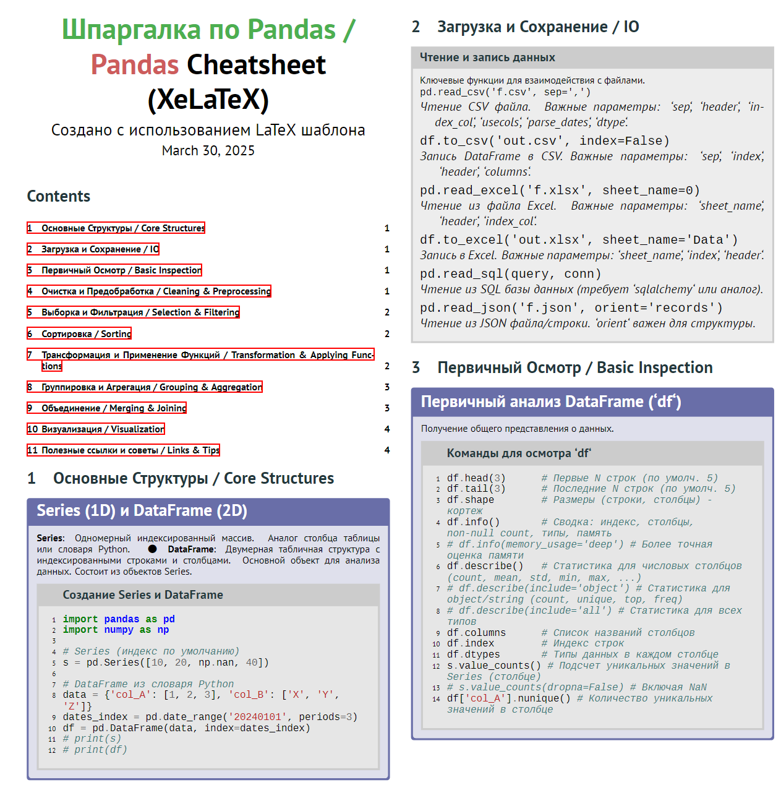

# 📝 Шаблон Шпаргалок на XeLaTeX

[](https://www.latex-project.org/)
[](https://www.tug.org/texlive/)
[](https://github.com/gpoore/minted)
[](https://opensource.org/licenses/MIT)

---

🚀 **Посмотреть Пример PDF (Шпаргалка по Pandas):**

*   📄 **[Скачать/Посмотреть Пример Шпаргалки (PDF)](docs/example.pdf)** *(Нажмите для просмотра или загрузки файла `docs/example.pdf` из этого репозитория)*

---

## 🖼️ Скриншоты Примера (Pandas Cheatsheet)


<p align="center">
  
</p>

---

## 📝 Обзор Проекта

Этот репозиторий содержит гибкий и настраиваемый **шаблон на XeLaTeX** (`cheatsheet-template.tex`), предназначенный для создания профессионально выглядящих шпаргалок, справочных материалов и конспектов. Шаблон использует возможности XeLaTeX для работы с современными шрифтами, `tcolorbox` для создания стильных блоков, `minted` для высококачественной подсветки синтаксиса кода и `biblatex` для управления библиографией.

В качестве **демонстрационного примера** включена подробная шпаргалка по библиотеке **Pandas** для анализа данных (`main-pandas.tex`, `contents/cheatsheet-pandas.tex`), показывающая различные возможности шаблона в действии.

**Ключевые возможности шаблона:**

1.  Многоколоночная верстка (`multicol`).
2.  Поддержка Unicode и современных шрифтов (`fontspec`).
3.  Настраиваемые блоки для текста, кода, примеров, предупреждений (`tcolorbox`).
4.  Подсветка синтаксиса для множества языков программирования (`minted` + `Pygments`).
5.  Автоматическое оглавление.
6.  Поддержка библиографии и сносок (`biblatex` + `biber`).
7.  Легкая адаптация под различные темы.

## 📂 Структура Проекта

```
├── contents/
│   └── cheatsheet-pandas.tex  # Пример контента (Pandas)
├── img/
│   └── pandas_plot_example.png # Пример изображения для шпаргалки
├── build/                       # Каталог для выходных файлов компиляции
├── main-pandas.tex              # Главный файл для примера с Pandas
├── cheatsheet-template.tex      # Основной шаблон - ИЗМЕНЯТЬ С ОСТОРОЖНОСТЬЮ
├── literature.bib               # Файл библиографии (для примера Pandas)
└── README.md                    # Этот файл
```

*   **`cheatsheet-template.tex`**: Содержит все определения стилей, команд и окружений.
*   **`contents/cheatsheet-*.tex`**: Файлы с основным содержанием шпаргалки (текст, код, команды `\section`, `\begin{textbox}` и т.д.).
*   **`main-*.tex`**: Главный файл документа. Задает геометрию страницы, подключает шаблон, контент, устанавливает заголовок/автора и запускает генерацию (`\documentclass`, `\input{template}`, `\input{content}`).
*   **`literature.bib`**: Файл `biblatex` для ссылок и библиографии.
*   **`img/`**: Папка для изображений, используемых в шпаргалке.
*   **`build/`**: Рекомендуемый каталог для временных файлов LaTeX и финального PDF (создается при компиляции с `-output-directory=build`).

## ⚙️ Требования

Для компиляции этого шаблона необходимы:

1.  **Дистрибутив LaTeX:** **TeX Live (2023 или новее)** рекомендуется. Включает `xelatex`, `biber` и необходимые пакеты (`fontspec`, `tcolorbox`, `minted`, `biblatex`, `multicol`, `hyperref`, `xcolor`, `fontawesome` и др.).
2.  **Шрифты:** Необходимо установить в систему следующие шрифты:
    *   **PT Sans** (включая Regular, Bold, Italic, Bold Italic) - основной шрифт. [Скачать с Google Fonts](https://fonts.google.com/specimen/PT+Sans)
    *   **Liberation Mono** (включая Regular) - для листингов кода. Обычно поставляется с Linux или [можно скачать](https://github.com/liberationfonts/liberation-fonts).
    *   *FontAwesome* (обычно включен в TeX Live как пакет `fontawesome5`).
3.  **Python:** (Обычно >= 3.6) Требуется для работы пакета `minted`. Должен быть доступен в системном `PATH`.
4.  **Библиотека Pygments:** Python-библиотека для подсветки синтаксиса, используется `minted`. Устанавливается через pip:
    ```bash
    pip install Pygments
    # или
    pip3 install Pygments
    ```

## 🛠️ Компиляция

Компиляция документа требует нескольких проходов и использования специальных опций из-за `minted` (требует `-shell-escape`) и `biblatex` (требует `biber`). Если вы хотите, чтобы временные файлы и PDF создавались в отдельной папке (например, `build`), используйте опцию `-output-directory` и **обязательно** установите переменную окружения `TEXMF_OUTPUT_DIRECTORY`.

**Рекомендуемая последовательность компиляции (Пример для Windows CMD):**

```bash
# 1. Устанавливаем переменную, чтобы minted знал, куда писать временные файлы
set TEXMF_OUTPUT_DIRECTORY=build

# 2. Первый проход XeLaTeX (с -shell-escape для minted и указанием папки вывода)
#    Создает .aux, .bcf и запускает minted для генерации файлов подсветки кода в build/_mintedmain-pandas/
xelatex -shell-escape -output-directory=build main-pandas.tex

# 3. Запуск Biber для обработки библиографии (указываем путь к .bcf файлу в папке build)
#    Читает build/main-pandas.bcf, создает build/main-pandas.bbl
biber build/main-pandas

# 4. Второй проход XeLaTeX (снова с -shell-escape и -output-directory)
#    Включает библиографию (.bbl) и обновляет ссылки/оглавление
xelatex -shell-escape -output-directory=build main-pandas.tex

# 5. Третий проход XeLaTeX (снова с -shell-escape и -output-directory)
#    Гарантирует, что все перекрестные ссылки и оглавление окончательно корректны
xelatex -shell-escape -output-directory=build main-pandas.tex

# 6. Очищаем переменную окружения (не обязательно, но хорошая практика)
set TEXMF_OUTPUT_DIRECTORY=
```

*   Замените `main-pandas.tex` на имя вашего главного `.tex` файла, если необходимо.
*   В **Linux/macOS** используйте `export TEXMF_OUTPUT_DIRECTORY=build` и `unset TEXMF_OUTPUT_DIRECTORY`.
*   Если вы **не** используете `-output-directory`, компилируйте в текущей папке и упустите шаги с `TEXMF_OUTPUT_DIRECTORY`, но не забудьте `-shell-escape`:
    ```bash
    xelatex -shell-escape main-pandas.tex
    biber main-pandas
    xelatex -shell-escape main-pandas.tex
    xelatex -shell-escape main-pandas.tex
    ```

## 🚀 Как Использовать Шаблон для Своей Шпаргалки

1.  **Скопируйте/переименуйте файлы:**
    *   Создайте копию `main-pandas.tex` (например, `main-yourtopic.tex`).
    *   Создайте копию `contents/cheatsheet-pandas.tex` (например, `contents/cheatsheet-yourtopic.tex`).
2.  **Настройте главный файл (`main-yourtopic.tex`):**
    *   Измените `\cheatsheettitle` и `\cheatsheetauthor`.
    *   Измените строку `\input{contents/cheatsheet-pandas.tex}` на `\input{contents/cheatsheet-yourtopic.tex}`.
3.  **Наполните контентом (`contents/cheatsheet-yourtopic.tex`):**
    *   Удалите или закомментируйте содержимое примера Pandas.
    *   Добавьте свои секции (`\section{...}`).
    *   Используйте окружения из `cheatsheet-template.tex` (`textbox`, `codebox`, `myblock`, `alerttextbox`, `myexampleblock` и т.д.) для форматирования вашего материала.
    *   Добавляйте код в блоки `codebox`, указывая язык программирования.
    *   Добавляйте изображения в папку `img/` и используйте `\mygraphics{img/your-image.png}`.
4.  **Обновите библиографию (`literature.bib`):**
    *   Добавьте свои источники в формате BibTeX.
    *   Используйте `\footcite{ключ}` или `\autocite{ключ}` в тексте для ссылок. Если библиография не нужна, удалите `\printbibliography` из `main-*.tex` и команду `\footcite` из контента.
5.  **Скомпилируйте** ваш `main-yourtopic.tex`, следуя инструкциям выше.

## 💡 Возможные Улучшения и Настройка

*   **Изменение цветов:** Определения цветов (`\definecolor`) находятся в `cheatsheet-template.tex`.
*   **Изменение шрифтов:** Команды `\setmainfont`, `\setmonofont` находятся в `cheatsheet-template.tex`. Убедитесь, что выбранные шрифты установлены в системе.
*   **Настройка блоков `tcolorbox`:** Параметры блоков (рамки, фон, отступы) можно изменить в определениях окружений (`\newenvironment`, `\newtcblisting`) в `cheatsheet-template.tex`.
*   **Добавление новых типов блоков:** Можно создать новые окружения на основе `tcolorbox` по аналогии с существующими.
*   **Изменение макета:** Настройки колонок (`multicols`) и геометрии страницы (`geometry`) находятся в `main-*.tex`.

## 📄 Лицензия

Этот проект распространяется под лицензией MIT.